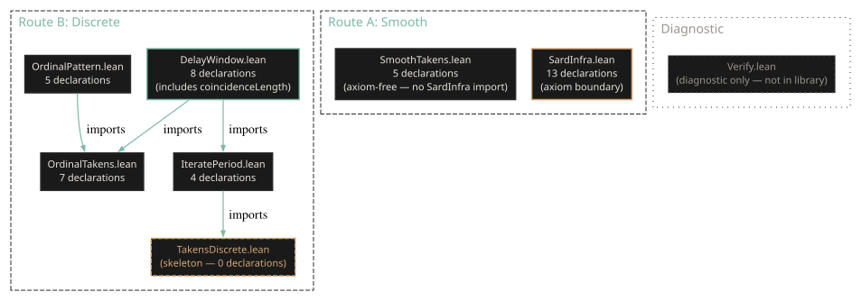

# Proof Architecture

This formalization takes an unusual approach: rather than following a single proof
strategy from hypothesis to conclusion, it develops two **independent proof routes**
that cover different aspects of delay embedding theory using incompatible
definitions.

## Why two routes?

Takens' 1981 theorem lives at the intersection of two mathematical worlds. The
**discrete** side concerns finite dynamical systems, orbit combinatorics, and
ordinal pattern extraction. The **smooth** side concerns compact manifolds,
continuous maps, and topological embeddings. These require fundamentally different
type signatures in Lean 4.

- **Route B (Discrete)** defines `delayEmbedding` as a map
  \(\mathrm{Fin}\,k \to \mathbb{R}\) via iterated function application on a
  finite type. It proves the core injectivity characterization and extends it with
  a novel coincidence length result that Takens did not prove.

- **Route A (Smooth)** defines `smoothDelayMap` as a continuous map from a
  topological space to \(\mathbb{R}^k\). It proves the embedding chain: compact +
  injective implies closed embedding and homeomorphism onto image.

These are not redundant --- they formalize different theorems with different
hypotheses and conclusions. Route A never imports Route B files. Route B never
imports `SardInfra`. The root aggregator (`TakensFormal.lean`) imports both, but
no definitions cross the boundary.

## Dependency diagram

The diagram shows the import structure across all 8 Lean source files.
`TakensDiscrete.lean` (dashed) is a skeleton with zero definitions --- future
finite-horizon corollaries will land here. `Verify.lean` (dotted) is a diagnostic
target that prints axiom dependencies for all 42 declarations; it is not part of
the library.

A key structural feature: **`SmoothTakens.lean` does not import `SardInfra.lean`**.
The entire embedding chain --- continuity, closed embedding, homeomorphism onto
image --- is proved without invoking Sard's theorem. This means Route A's results
are fully axiom-free, depending only on Lean's foundational axioms (`propext`,
`Classical.choice`, `Quot.sound`). The Sard infrastructure exists to support the
*future* genericity theorem, not the embedding chain itself.

## What is new, what is formalized, what is infrastructure

This formalization contains three categories of results:

### Novel mathematics

The **coincidence length** and the iff characterization
`exists_separatingWindow_iff` are new results that extend Takens' 1981 theorem.
Takens proved that delay embedding is generically injective for smooth dynamical
systems on compact manifolds. The coincidence length answers a different question:
for *finite* dynamical systems with a possibly non-injective observation, *when*
does the observation still separate orbits? The answer --- iff every coincidence
between distinct orbits has bounded length --- is not in the literature.

See [Beyond Takens: Coincidence Length](coincidence-length.md) for the full
treatment.

### Formalized results

The delay embedding injectivity characterization
(`delayEmbedding_injective_iff_separatesOrbits`), the ordinal pattern theory
(Bandt and Pompe 2002), and the smooth embedding chain (Takens 1981) are
machine-checked formalizations of known results. The value is not novelty but
**certainty**: every hypothesis is explicit, every step is verified, and the axiom
boundary is transparent.

### Infrastructure

Sard's theorem infrastructure (`SardInfra.lean`) provides the critical set and
critical values definitions, proves the equidimensional case via the Jacobian area
formula, and proves the low-dimensional case via Hausdorff dimension bounds. The
high-dimensional case (Morse--Sard induction) is deferred to gate 3. This
infrastructure will eventually support the genericity theorem connecting Sard to
delay embedding.

See [Sard Infrastructure](sard-infrastructure.md) for the mathematical details.

## References

- Takens, F. (1981). "Detecting strange attractors in turbulence." In *Dynamical
  Systems and Turbulence, Warwick 1980*, Lecture Notes in Mathematics 898,
  pp. 366--381. Springer.
- Sauer, T., Yorke, J. A., and Casdagli, M. (1991). "Embedology." *Journal of
  Statistical Physics* 65(3--4), pp. 579--616.
