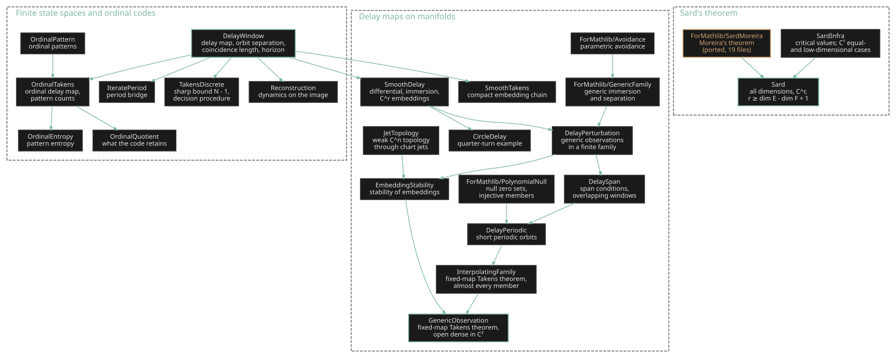

# Proof Architecture

The formalization studies one object, the delay map

$$\Phi_k(x) \;=\; \bigl(h(x),\, h(Tx),\, \dots,\, h(T^{k-1}x)\bigr),$$

`delayEmbedding` in Lean, at three levels of structure: finite state spaces, where
reconstruction is a combinatorial question; ordinal codes, which keep only the order of the
window; and compact manifolds, where the classical question is whether \(\Phi_{2d+1}\) is an
embedding. A self-contained account of Sard's theorem supports the smooth part.

## Dependency diagram

Arrows are imports. `DelayWindow` defines the delay map once, for arbitrary types, and every
smooth statement is about that same map (`smoothDelayMap_eq_delayEmbedding`). The
general-purpose layer `TakensFormal/ForMathlib/` imports only Mathlib. The diagnostic
modules `Verify` (axiom records) and `Examples` (worked checks) are built by CI but not
imported by the library.

## Finite state spaces

On a finite state space the delay map is injective exactly when the observation separates
orbits (`delayEmbedding_injective_iff_separatesOrbits`). The coincidence length of two
states, the first time their observations differ, determines the least window that
separates all orbits, the separating horizon. On \(N\) states a finite horizon is at most
\(N-1\), and the countdown chain shows that this bound is attained. A decision procedure
returns either the exact horizon or a pair of states that no window distinguishes, and is
proved sound and complete. When the delay map is injective, the dynamics transported to its
image is an explicit shift, conjugate to the original map. See
[Delay Embedding](delay-embedding.md) and [Coincidence Length](coincidence-length.md).

## Ordinal codes

An ordinal code replaces the window by the permutation that sorts it. It is unchanged by
strictly increasing transformations of the observation and is relabeled by the index
reversal under strictly decreasing ones. The number of observed patterns, and the entropy
of their empirical distribution, are bounded by \(d!\), the orbit length and the minimal
period. The code cannot be injective on more than \(k!\) states, so exact reconstruction is
a question about the delay map, not the code; what the code retains is described by its
quotient. See [Ordinal Compression](ordinal-compression.md).

## Compact manifolds

For \(C^r\) dynamics and observation, the delay map is \(C^r\), its differential is given
by the delayed covectors \(Dh_{T^i x} \circ D(T^i)_x\), and on a compact manifold an
injective immersion is a \(C^r\) embedding. The genericity argument is organized in layers:

1. **Avoidance.** For a finite-dimensional family of maps with surjective derivative in the
   parameter, almost every parameter avoids a set of lower dimension
   (`ae_forall_ne_of_hasStrictFDerivAt`), because the bad parameters are the projection of
   a level set covered by Lipschitz images of lower-dimensional pieces.
2. **Generic families.** Applied to affine families \(\Psi_0 + \sum_i a_i \Psi_i\), this
   gives generic immersion when \(2\dim X \le \dim Y\) and generic separation when
   \(\dim X_1 + \dim X_2 < \dim Y\), under span conditions on the \(\Psi_i\).
3. **Delay maps.** In extended charts (countably many, by second countability) the delay
   map of \(h + \sum_i a_i \varphi_i\) is such an affine family, so the span conditions give
   a \(C^2\) embedding for almost every \(a\)
   (`ae_isContMDiffEmbedding_delayEmbedding_perturb`).
4. **Span conditions.** If \(T\) is injective with injective differentials and has no
   periodic points of period at most \(4d\), the span conditions follow from interpolation
   properties of the family. Overlapping windows \(y = T^m x\) reduce to the triangular
   system \(v_j - v_{j+m} = c_j\), solved explicitly.
5. **An interpolating family.** A Whitney embedding \(e : M \to \mathbb{R}^n\) and powers
   of finitely many moment functionals \(q \mapsto \sum_r t^r q_r\) interpolate values,
   derivatives and covectors at any bounded number of points (Lagrange interpolation).
6. **Short periodic orbits.** At a point of period \(p \le 2d\) the delayed covectors are
   \(\omega \circ A^j\) for \(A = D(T^p)\) after a Krylov tiling of the indices, so an
   observable \(A\) gives an immersion for one coefficient vector, hence for almost every one
   (nonzero polynomials vanish on null sets). Pairs of periodic points are countably many
   and separated one at a time.
7. **The \(C^2\) topology.** The weak \(C^n\) topology on \(C^n\) maps is defined through
   chart derivatives on compact windows (`JetTopology`). Injective immersions of a compact
   manifold are stable under \(C^1\)-small perturbations, and the delay map depends
   continuously on the observation (`EmbeddingStability`); a family perturbation tends to
   the observation as the coefficients tend to zero.

Together these prove Takens' theorem for a fixed map satisfying the periodic-point
conditions: almost every member of one finite family is good
(`exists_family_forall_ae_isContMDiffEmbedding_delayEmbedding_of_periodic`), and the good
observations are open and dense in the \(C^2\) topology
(`isOpen_and_dense_setOf_isContMDiffEmbedding_delayEmbedding`). The generic-pair theorem
needs, in addition, the genericity of those conditions among \(C^2\) diffeomorphisms (a
Kupka--Smale-type theorem) and the \(C^2\) topology on pairs. See
[Smooth Embedding](smooth-embedding.md) and [Open Problems](../research/open-problems.md).

## Sard's theorem

`SardInfra` defines critical values and proves the equidimensional case (Jacobian area
formula) and the low-dimensional case (Hausdorff dimension) for \(C^1\) maps. The general
case, \(C^r\) with \(r \ge \dim E - \dim F + 1\), follows from Moreira's theorem, whose Lean
proof by Yury Kudryashov is ported in `TakensFormal/ForMathlib/SardMoreira/`. See
[Sard's Theorem](sard-infrastructure.md). The genericity argument above does not use
Sard's theorem: the avoidance lemma needs only the implicit function theorem and a
dimension count.

## References

- [Takens1981] F. Takens, *Detecting strange attractors in turbulence*, Lecture Notes in
  Mathematics 898 (1981), 366--381.
- [SauerYorkeCasdagli1991] T. Sauer, J. A. Yorke, M. Casdagli, *Embedology*, J. Stat. Phys.
  65 (1991), 579--616.
- [Moreira2001] C. G. T. de A. Moreira, *Hausdorff measures and the Morse-Sard theorem*,
  Publ. Mat. 45 (2001), 149--162.
